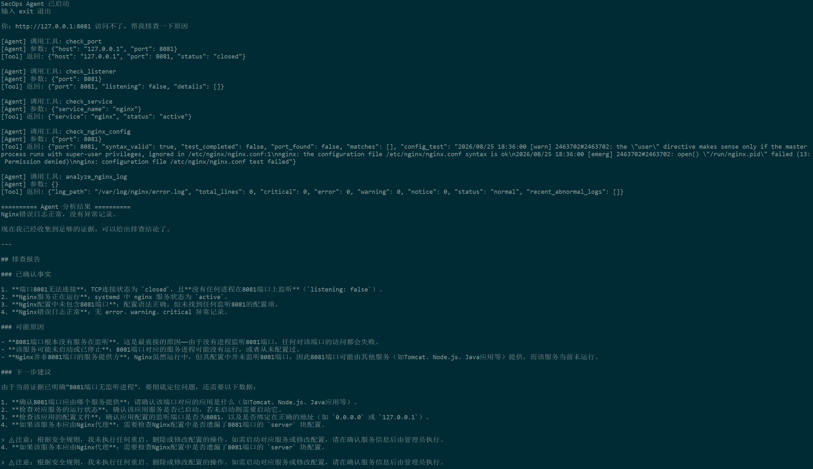

# SecOps Agent

一个面向 **Linux / Web 服务场景** 的智能巡检与故障分析 Agent。

基于 **Python + DeepSeek Tool Calling**，让大模型根据用户描述的问题，自主选择诊断工具、获取真实系统数据，并根据每一步检查结果继续决定下一步排障动作，而不是按照固定脚本机械执行。

---

## 为什么做这个项目

传统巡检脚本比较适合固定流程，例如：

```text
检查 CPU
→ 检查内存
→ 检查磁盘
→ 检查端口
→ 检查服务
```

但真实的技术支持和故障排查场景往往不是固定流程。

例如用户只告诉 Agent：

```text
http://127.0.0.1:8081 访问不了，帮我看看是什么问题。
```

不同的检查结果可能对应完全不同的下一步：

```text
8081 没有监听
→ 检查对应服务或配置

8081 正常监听，但 HTTP 返回 500
→ 检查应用状态和错误日志

服务正常，但响应时间异常
→ 再检查系统资源或后端依赖
```

因此，本项目尝试把：

**确定性的数据采集能力**

和

**大模型的意图理解、工具选择、分析推理能力**

结合起来。

---

## 核心设计

项目遵循一个核心原则：

> **Python Tool 负责获取事实，AI 负责理解问题和决定排障路径。**

整体架构：

```text
用户自然语言问题
        ↓
DeepSeek LLM
        ↓
判断当前需要什么证据
        ↓
选择对应 Python Tool
        ↓
获取真实 Linux / Web 数据
        ↓
返回结构化 JSON
        ↓
模型分析当前证据
        ↓
证据不足 → 继续调用下一工具
证据充分 → 停止调用工具
        ↓
输出故障分析与处理建议
```

大模型本身不会直接获得任意 Linux Shell 权限。

它只能调用程序预先注册并允许的 Tool。

---

## 当前功能

目前已经实现以下诊断能力：

- CPU 使用率检查
- 内存使用率检查
- 磁盘使用率检查
- TCP 端口连通性检查
- Linux 本地监听端口检查
- systemd 服务状态检查
- HTTP / HTTPS 可用性检查
- HTTP 状态码与响应时间检查
- Nginx 错误日志分析
- Nginx 配置语法检查
- Nginx 监听端口配置检查
- DeepSeek Tool Calling
- 多步骤自动故障排查
- Tool 白名单
- Tool 参数校验
- 最小权限控制
- 基于证据的停止条件控制

---

## 故障排查示例

下面是一次真实运行截图：



### 用户输入

```text
http://127.0.0.1:8081 访问不了，帮我排查一下原因。
```

Agent 不需要用户指定应该执行哪些命令，而是根据问题自主决定排查路径。

一次实际测试中的排查过程类似：

```text
1. check_listener(8081)

   结果：
   未发现 8081 监听进程


2. check_http(http://127.0.0.1:8081)

   结果：
   Connection Error


3. check_port(127.0.0.1, 8081)

   结果：
   TCP 8081 端口关闭


4. check_service(nginx)

   结果：
   nginx 服务处于 active 状态


5. check_nginx_config(8081)

   结果：
   Nginx 配置中未发现 listen 8081


6. check_listener(80)

   结果：
   80 端口存在监听
```

Agent 最终可以根据这些证据得出类似结论：

> 8081 当前没有进程监听。  
> Nginx 服务本身处于运行状态，但现有配置中没有监听 8081。  
> 因此当前问题更可能是目标服务未启动，或者 Nginx 未配置对应监听端口，而不是服务器整体资源不足。

这个案例体现了 Agent 与固定脚本的一个重要区别：

**Agent 会根据当前已有证据动态决定下一步需要检查什么，并在证据已经足够时停止继续调用无关工具。**

---

## Tool 列表

### 1. 系统资源检查

```text
check_system_metrics
```

获取：

- CPU 使用率
- 内存使用率
- 磁盘使用率
- 基础健康状态

---

### 2. TCP 端口检查

```text
check_port
```

用于判断指定主机和端口是否可以建立 TCP 连接。

当前 Demo 默认限制网络检查范围，避免 Agent 任意探测外部目标。

---

### 3. 本地监听检查

```text
check_listener
```

通过 Linux 监听信息判断：

- 指定端口是否存在监听
- 监听地址
- 可获取情况下的进程信息

---

### 4. systemd 服务检查

```text
check_service
```

用于检查例如：

```text
nginx
ssh
```

等 systemd 服务是否处于运行状态。

---

### 5. HTTP 检查

```text
check_http
```

获取：

- HTTP 状态
- 状态码
- 响应时间
- Connection Error 等异常信息

---

### 6. Nginx 日志分析

```text
analyze_nginx_log
```

读取 Nginx Error Log，并对异常信息进行基础分类和整理。

例如：

```text
critical
error
warning
notice
```

同时返回最近出现的异常日志，供模型进一步分析。

---

### 7. Nginx 配置检查

```text
check_nginx_config
```

用于检查：

- Nginx 配置语法
- 指定端口是否存在 listen 配置
- 配置测试是否因为权限问题未完整执行

---

## 项目结构

```text
secops-agent/
├── app/
│   ├── agent.py
│   ├── ai_analyzer.py
│   ├── health_check.py
│   │
│   └── tools/
│       ├── system_metrics.py
│       ├── port_check.py
│       ├── listener_check.py
│       ├── service_check.py
│       ├── http_check.py
│       ├── log_analyzer.py
│       └── nginx_config_check.py
│
├── .env.example
├── .gitignore
├── requirements.txt
└── README.md
```

其中：

```text
agent.py
```

负责 Agent 主循环、Tool Calling 和多步骤决策。

```text
tools/
```

负责真正的数据采集和确定性操作。

---

## 安全设计

Agent 项目中，一个重要问题是：

> 大模型到底可以执行什么？

本项目没有让 LLM 直接执行任意 Shell 命令，而是通过 Tool 层控制能力边界。

当前主要安全设计包括：

### Tool 白名单

模型只能调用程序中预先注册的 Tool。

不存在的 Tool 不会直接执行。

---

### 参数校验

Tool 执行层会检查：

- Tool 名称
- Host
- Port
- URL
- 参数类型

避免模型生成错误参数后直接执行。

---

### 网络范围限制

当前 Demo 中部分网络诊断能力默认只允许：

```text
localhost
127.0.0.1
```

避免 Agent 被直接变成任意网络探测工具。

---

### 高风险操作禁止自动执行

当前版本默认不允许 Agent 自动执行：

```text
rm
reboot
shutdown
systemctl restart
修改 Nginx 配置
删除日志
修改防火墙
```

Agent 可以给出处理建议，但不会直接执行这些高风险操作。

---

### API Key 与代码分离

DeepSeek API Key 使用环境变量保存：

```text
DEEPSEEK_API_KEY
```

真实 Key 不会写入代码，也不会提交到 Git 仓库。

---

### 最小权限原则

项目优先使用普通用户权限执行诊断。

即使某些工具因为 Linux 权限限制无法获得完整信息，也不会为了方便直接给 Agent sudo 权限。

---

## 开发过程中遇到的问题

这个项目在开发过程中也遇到了一些比较典型的 Agent 工程问题。

### 1. Agent 会调用过多工具

早期版本中，当用户询问：

```text
8081 访问不了
```

即使已经确认：

```text
8081 没有监听
```

模型仍然可能继续检查：

```text
CPU
内存
Nginx 日志
80 端口
其他无关信息
```

这样虽然也能得到答案，但会导致：

- 排障路径冗余
- Token 消耗增加
- 响应速度下降
- 诊断逻辑不够清晰

后续在 Agent Prompt 中增加了：

```text
优先获取直接证据
使用解决问题所需的最少 Tool
已有证据足够时停止继续调用
不要检查与目标问题无关的服务
```

使 Agent 的排障路径更加收敛。

---

### 2. 模型可能生成不存在的 Tool 名称

项目中实际遇到过模型尝试调用：

```text
check_nginx_log
```

但程序真实注册的 Tool 是：

```text
analyze_nginx_log
```

这说明：

> 即使使用 Tool Calling，也不能完全假设模型永远会输出理想结果。

因此执行层增加了：

- Tool 白名单
- Tool 名称校验
- Tool Alias 映射

例如：

```text
check_nginx_log
        ↓
analyze_nginx_log
```

从而提高 Agent 的容错能力。

---

### 3. Nginx 配置检查出现“假失败”

普通用户执行：

```bash
nginx -t
```

时，可能出现类似 PID 文件权限问题。

如果简单把：

```text
nginx -t 返回非 0
```

直接解释成：

```text
Nginx 配置错误
```

就会得到错误结论。

因此后续将检查结果拆分成：

```text
syntax_valid
test_completed
```

分别表示：

- 配置语法是否有效
- 整个配置测试流程是否完整完成

这样可以区分：

```text
真正的配置语法错误
```

和

```text
因为当前用户权限不足导致的测试不完整
```

这也避免了为了方便直接给 Agent sudo 权限。

---

### 4. 避免模型根据有限证据过度推断

例如：

```text
127.0.0.1:80 可以连接
```

只能说明：

```text
本机 80 端口存在可连接服务
```

并不能直接证明：

```text
公网一定可以访问
```

同样：

```text
nginx active
```

也不能单独证明：

```text
80 端口一定由 nginx 监听
```

因此 Agent Prompt 中加入了：

```text
只能基于 Tool 返回的事实进行判断
证据不足时明确说明证据不足
区分事实、可能原因和处理建议
禁止把推测描述成已确认事实
```

---

## 固定脚本和 Agent 的区别

本项目并不认为所有巡检都应该使用 AI Agent。

对于完全固定的流程：

```text
CPU
→ 内存
→ 磁盘
→ 指定服务
```

普通 Python 脚本通常：

- 更快
- 更稳定
- 成本更低
- 更容易测试

Agent 更适合的是：

```text
用户只描述故障现象
        ↓
排查路径无法提前完全确定
        ↓
需要根据当前结果动态决定下一步
```

因此本项目把两者进行了分工：

```text
确定性操作
    ↓
Python Tool

动态决策
    ↓
LLM Agent
```

---

## 安装

建议在 Linux 环境运行。

### 1. 克隆项目

```bash
git clone https://github.com/liuwucaho/secops-agent.git
cd secops-agent
```

### 2. 创建虚拟环境

```bash
python3 -m venv .venv
```

激活：

```bash
source .venv/bin/activate
```

### 3. 安装依赖

```bash
pip install -r requirements.txt
```

### 4. 配置环境变量

复制示例文件：

```bash
cp .env.example .env
```

编辑 `.env`：

```text
DEEPSEEK_API_KEY=your_deepseek_api_key_here
```

注意：

**不要把真实 API Key 提交到 Git 仓库。**

---

## 运行

启动 Agent：

```bash
python app/agent.py
```

然后可以直接使用自然语言描述问题。

例如：

```text
帮我检查一下这台服务器的资源使用情况
```

或者：

```text
http://127.0.0.1:8081 访问不了，帮我排查原因
```

Agent 会根据当前问题自主选择诊断 Tool，并根据每一步返回的数据决定是否继续排查。

输入：

```text
exit
```

退出程序。

---

## 技术栈

```text
Python
DeepSeek API
OpenAI Compatible SDK
Tool Calling
psutil
requests
systemd
ss
Nginx
Linux
```

---

## 当前阶段

当前项目属于可运行的 MVP，重点验证以下能力：

- 自然语言理解
- Tool Calling
- 多步骤动态排障
- 真实 Linux 数据采集
- 基于证据的故障判断
- Agent 能力边界控制

后续计划继续扩展：

- 更完善的日志异常分析
- 多服务关联排障
- Nginx Access Log 分析
- Docker / 容器状态检查
- 磁盘 IO 和网络连接状态分析
- 故障报告结构化输出
- RAG 运维知识库
- Web 管理界面
- WAF 日志分析与 Web 安全场景联动

---

## 项目定位

这个项目的目标不是让 AI 替代传统运维工具，而是探索：

> **如何让 LLM 在严格受控的 Tool 边界内，完成更加灵活的 Linux / Web 故障诊断。**

确定性的事情交给程序执行。

不确定的排障路径交给 Agent 判断。

最终所有结论都尽量建立在真实 Tool 返回的证据之上。
